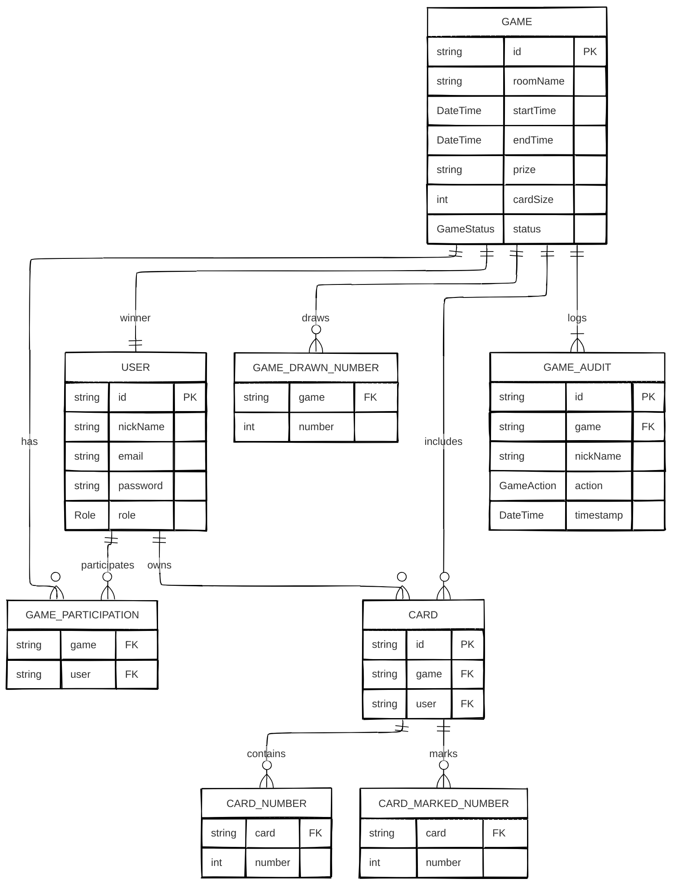

<p align="right"><a href="https://github.com/DanielKGM/ebingo-frontend" target="_blank">Repositório do Front-End (Angular)</a></p>

<a id="readme-top"></a>

# Sobre o projeto

<center>

<p><strong>PARTIDAS DE BINGO ONLINE</strong></p>
</center>

## Objetivo

**eBingo** é o que acredito ser o mínimo produto viável para um <i>website</i> de bingo interativo, onde usuários podem participar de partidas <i>online</i> e em tempo real. Este repositório contem a <i>API</i> do projeto responsável por receber requisições dos usuários para processamento de jogos de forma segura e escalável.

## Fluxo Geral

O usuário poderá criar sua conta, autenticar-se, procurar por partidas disponíveis, entrar em salas de jogo, gerar sua cartela e competir ou acompanhar o jogo em tempo real, desde que haja um administrador para orquestrar a partida. Adicionalmente, poderá ganhar **prêmios** (textos secretos disponíveis em cada sala de jogo) e conferir o seu perfil.

## Funcionalidades

- [x] Autenticação e registro de usuários;
- [x] Jogador pode visualizar e editar seu perfil;
- [x] Diferentes Permissões entre usuários comuns e administradores;
- [x] Gerenciamento e criação de jogos pelos administradores;
- [x] Usuários visualizar uma lista de jogos e entrar neles;
- [x] Vencedor de cada jogo tem acesso a um texto exclusivo;
- [x] Sistema exige autenticação para resgatar o prêmio;
- [x] Gerar cartelas de bingo automaticamente para cada jogador;
- [x] Cada jogo terá um ranking em tempo real;
- [x] Sorteio de números pelos administradores e exibição dos resultados para todos os participantes em tempo real;
- [x] O sistema valida automaticamente quando uma cartela completa a sequência vencedora;
- [x] Preenchimento manual e obrigatório das cartelas.
- [x] Filtro por nome e/ou por status na listagem de jogos;
- [x] Usuários podem visualizar a sala sem entrar no jogo;
- [x] Auditoria e histórico do jogo;
- [x] Criptografia de senha e proteção de endpoints.
<p align="right">(<a href="#readme-top">voltar ao topo</a>)</p>

# Tecnologias Utilizadas

## Java

|                                                                                                                                     |    Nome     | Versão  |
| :---------------------------------------------------------------------------------------------------------------------------------: | :---------: | ------- |
|         |    Java     | `21`    |
|  | Spring Boot | `-`     |
|        |    Maven    | `3.9.9` |
|       |   Lombok    | `-`     |

## Comunicação

|                                                                                                                                   |   Nome    |
| :-------------------------------------------------------------------------------------------------------------------------------: | :-------: |
|  | websocket |
|       |   REST    |

## Banco de Dados

|                                                                                                                               | Nome  | Versão |
| :---------------------------------------------------------------------------------------------------------------------------: | :---: | ------ |
|  | MySQL | `8`    |

## DevOps

|                                                                                                                                |  Nome  |
| :----------------------------------------------------------------------------------------------------------------------------: | :----: |
|  | Docker |

<p align="right">(<a href="https://github.com/DanielKGM/ebingo-backend/blob/main/pom.xml">pom.xml</a>) (<a href="#readme-top">voltar ao topo</a>)</p>

# Execução do Projeto em Contâiner

## Requisitos

- Baixe o [Git](https://git-scm.com/downloads) e o [Docker Desktop](https://www.docker.com/products/docker-desktop/).

## Passo a Passo

1. Crie uma pasta para o projeto;
2. Dentro dessa pasta, **clone** (ou baixe) os projetos `ebingo-frontend` e `ebingo-backend`, através dos comandos:

```sh
git clone https://github.com/DanielKGM/ebingo-backend
```

```sh
git clone https://github.com/DanielKGM/ebingo-frontend
```

3. Abra o **Docker Desktop**, após algumas configurações básicas exigidas pelo instalador da aplicação;
4. Vá para o diretório do projeto **ebingo-backend** (onde tem o arquivo `compose.yaml`) e execute o seguinte comando:

```sh
docker-compose up --build
```

<p align="right">(<a href="#readme-top">voltar ao topo</a>)</p>

# Persistência de Dados

O **MySQL 8** é instalado em um container através dos passos anteriores. Tabelas, restrições e relacionamentos são gerados programaticamente pelo Spring Data JPA, conforme os [modelos](https://github.com/DanielKGM/ebingo-backend/tree/main/src/main/java/br/danielkgm/ebingo/model) do projeto. O resultado pode ser representado pelo diagrama ER a seguir:



<p align="right">(<a href="#readme-top">voltar ao topo</a>)</p>

# Contribuições

## Recursos a Serem Implementados

🔒
